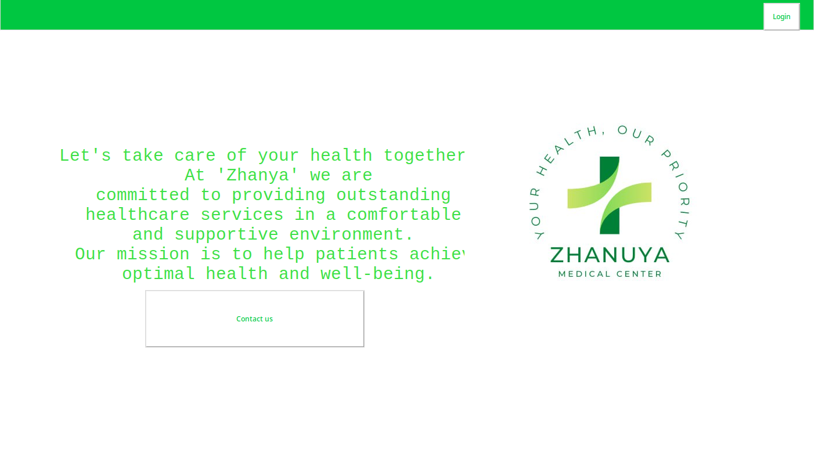

# Januya


Januya is a user-friendly GUI application developed during a hackathon in the first semester. The application is designed to facilitate seamless communication between users and healthcare professionals, particularly doctors. Built using Python and the tkinter library, Januya provides a simple yet effective platform for users to contact their doctors, fostering a convenient and efficient healthcare experience.

## Compile
```
python main.py
```

##### Note
*during some testing and lack of some files, the sql database may not work*
